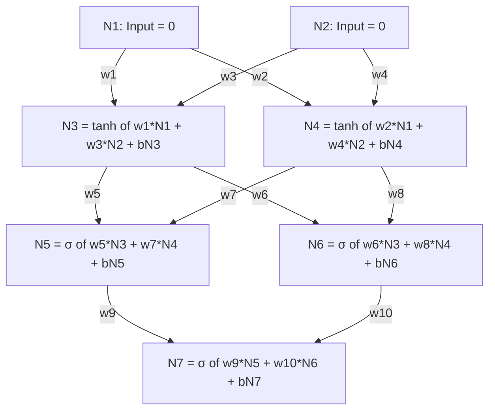

# Basic Neural Network (NN) Implementation using C#

This document explains in detail how this C# codebase implements a **feedforward neural network** with **backpropagation** for supervised learning. The example program trains the network to behave like a **NAND logic gate**.

---

## Table of Contents

1. [Overview](#overview)
2. [Project Structure](#project-structure)
3. [Core Models](#core-models)
4. [Activation Functions](#activation-functions)
5. [Network Construction and Wiring](#network-construction-and-wiring)
6. [Training Algorithm](#training-algorithm)
7. [Mathematical Details](#mathematical-details)
8. [Program Flow (NAND Example)](#program-flow-nand-example)
9. [Utilities](#utilities)
10. [Screenshot](#screenshot)

---

## Overview

The implementation is a **fully connected (dense) multilayer perceptron (MLP)**:

- **Input layer**: receives feature vectors (e.g., two values for a 2-input gate).
- **Hidden layers**: one or more layers with nonlinear activations (Tanh).
- **Output layer**: one neuron with Logistic Sigmoid, producing a value in (0, 1).

Training uses:

- **Forward pass**: compute outputs layer by layer.
- **Backward pass**: compute error gradients (local deltas) via backpropagation.
- **Weight update**: gradient descent using a fixed learning rate.

The loss is **squared error** between the network’s single output and the target; the derivative is used explicitly in the backward pass.

---

## Project Structure

| Path | Purpose |
|------|--------|
| `Models/NeuralNetwork.cs` | Top-level container: list of layers and current prediction. |
| `Models/Layer.cs` | A layer of neurons; knows if it’s input/output. |
| `Models/Neuron.cs` | Single neuron: bias, connections, activation, input/output, local delta. |
| `Models/Connection.cs` | Weight and reference to the target neuron in the next layer. |
| `Interfaces/IActivationFunction.cs` | Contract: `Activate(x)` and `Derivative(x)`. |
| `Interfaces/ILossFunction.cs` | Placeholder for future loss abstractions. |
| `Activations/NoActivation.cs` | Identity: used for input layer. |
| `Activations/Tanh.cs` | Hidden layers. |
| `Activations/LogisticSigmoid.cs` | Output layer (bounded 0–1). |
| `Extensions/DumpExtensions.cs` | Console pretty-print for network, layers, neurons, connections. |
| `Program.cs` | Build network, connect, train, and predict (NAND example). |

Dense linear algebra (inputs, outputs, rows) uses **MathNet.Numerics** (`Matrix<double>`, `Vector<double>`).

---

## Core Models

### NeuralNetwork

- **Role**: Holds the full network and the last scalar prediction.
- **Properties**:
  - `Layers`: list of `Layer` (input, hidden, output).
  - `Prediction`: output of the last forward pass (single output neuron).
  - `LossFunction`: optional; not used in the current training loop.
- **Constructor**: `NeuralNetwork(List<int> numOfNeuronsInEachLayer)`
  - One integer per layer: e.g. `[2, 2, 2, 1]` → 2 inputs, two hidden layers of 2 neurons, 1 output.
  - Builds each `Layer` with the right number of neurons and connections (see [Layer](#layer)).

### Layer

- **Role**: One layer of neurons; assigns activation type and number of outgoing connections.
- **Properties**:
  - `Neurons`: list of `Neuron`.
  - `IsInputLayer`, `IsOutputLayer`: used for activation choice and (in backprop) whether to update bias.
- **Constructor**: `Layer(int numOfNeurons, int numOfNeuronsInNextLayer, bool isInputLayer)`
  - **Input layer**: `NoActivation`, each neuron still has `numOfNeuronsInNextLayer` connections.
  - **Hidden layers**: `Tanh`, each neuron has that many connections to the next layer.
  - **Output layer**: `LogisticSigmoid`, `numOfNeuronsInNextLayer == 0`, so no connections.

### Neuron

- **Role**: Stores pre-activation (`Input`), post-activation (`Output`), bias, and error gradient (`LocalDelta`).
- **Properties**:
  - `Activation`: `IActivationFunction` for this layer.
  - `Bias`: scalar bias (initialized to 0).
  - `Input`, `Output`: pre- and post-activation values.
  - `LocalDelta`: $\delta$ in backpropagation (gradient of loss w.r.t. this neuron’s pre-activation).
  - `Connections`: list of `Connection` to neurons in the **next** layer.
- **Constructor**: Creates one neuron with a given activation and a fixed number of `Connection` objects (weights are initialized randomly in `Connection`).

### Connection

- **Role**: One weighted link from a neuron to a neuron in the next layer.
- **Properties**:
  - `Weight`: scalar (initialized to a random value in (0, 1)).
  - `TargetNeuron`: the neuron in the next layer that receives this connection.
- `TargetNeuron` is set later by `ConnectNeuralNetwork` (see [Network Construction](#network-construction-and-wiring)).

---

## Activation Functions

All implement `IActivationFunction`: `Activate(double x)` and `Derivative(double x)`.

| Class | Usage | Formula | Derivative |
|-------|--------|---------|------------|
| **NoActivation** | Input layer | $y = x$ | $1$ |
| **Tanh** | Hidden layers | $y = \tanh(x)$ | $1 - y^2$ |
| **LogisticSigmoid** | Output layer | $y = \frac{1}{1+e^{-x}}$ | $y(1-y)$ |

- **Tanh**: bounds hidden outputs to $(-1, 1)$; helps with gradient behavior in hidden layers.
- **Sigmoid**: bounds the single output to $(0, 1)$, suitable for a binary target (e.g. logic gate 0/1).

---

## Network Construction and Wiring

1. **Create**: `CreateNeuralNetwork(new List<int> { 2, 2, 2, 1 })`  
   Builds a network with 2 → 2 → 2 → 1 neurons per layer. Each neuron already has the correct number of `Connection` objects (random weights); `TargetNeuron` is still `null`.

2. **Connect**: `ConnectNeuralNetwork(nn)`  
   For each layer (except the last), for each neuron, each connection is tied to the corresponding neuron in the next layer:
   - `connection.TargetNeuron = nn.Layers[index + 1].Neurons[connIndex]`
   So the graph is fully connected between consecutive layers.

Result: a fully connected MLP with one input layer, two hidden layers, and one output neuron, ready for forward/backward passes.

---

## Training Algorithm

Training is **online (stochastic) gradient descent**: one example at a time, update weights after each example.

For each **epoch** and each **training row**:

1. **FeedForward(nn, inputRow)**  
   - Set input layer neurons’ `Input` and `Output` from `inputRow`.  
   - For each subsequent layer, for each neuron:  
     - `Input = bias + sum(prevNeuron.Output * connection.Weight)` over all incoming connections.  
     - `Output = Activation.Activate(Input)`.  
   - The last neuron’s `Output` is stored in `nn.Prediction`.

2. **BackwardPass(nn, correctOutput)**  
   - **Output neuron**:  
     - Loss is squared error: $\frac{1}{2}(y - t)^2$. Derivative w.r.t. $y$ is $(y - t)$. The code uses $2(y - t)$, which corresponds to the derivative of $(y-t)^2$ (no $\frac{1}{2}$).  
     - Chain rule: `LocalDelta = (2 * (prediction - correctOutput)) * Activation.Derivative(Input)`.  
   - **Other layers** (from last hidden back to first):  
     - For each neuron, `LocalDelta = Activation.Derivative(Input) * sum(Weight * TargetNeuron.LocalDelta)` over all outgoing connections.  
   - Layers are reversed in memory for the loop, then reversed back so the list stays in forward order.

3. **AdjustWeights(nn, learningRate)**  
   - For every neuron that is **not** in the output layer:  
     - **Bias**: `Bias -= learningRate * LocalDelta` (input layer is skipped for bias in the code).  
     - **Connections**: `Weight -= learningRate * TargetNeuron.LocalDelta * neuron.Output` (gradient of loss w.r.t. weight).

So the loss is implicitly **squared error**; the learning rule is gradient descent on that loss with a fixed step size.

---

## Mathematical Details

### Forward pass (single neuron)

$$
z = b + \sum_j w_j \, a_j,\qquad a = f(z)
$$

- $b$: bias  
- $w_j$: weights from previous layer  
- $a_j$: outputs from previous layer  
- $f$: activation (Tanh or Sigmoid)  
- $z$: `Input`, $a$: `Output`

### Loss and output gradient

$$
L = (y - t)^2 \quad\Rightarrow\quad \frac{\partial L}{\partial y} = 2(y - t)
$$

With $y = f(z)$:

$$
\frac{\partial L}{\partial z} = \frac{\partial L}{\partial y} \, f'(z) = 2(y - t)\, f'(z)
$$

This is the **output neuron’s** `LocalDelta`.

### Backpropagation (hidden and input layers)

For a neuron with pre-activation $z$ and activation $a = f(z)$, and outgoing weights $w_k$ to neurons with deltas $\delta_k$:

$$
\delta = f'(z) \sum_k w_k \, \delta_k
$$

That sum runs over all connections from this neuron to the next layer; $\delta_k$ is `TargetNeuron.LocalDelta`.

### Weight and bias updates

$$
w_j \leftarrow w_j - \eta \, \delta_{\text{target}} \, a_j,\qquad b \leftarrow b - \eta \, \delta
$$

- $\eta$: learning rate  
- $\delta_{\text{target}}$: `TargetNeuron.LocalDelta` for the connection  
- $a_j$: `neuron.Output` (activation of the source neuron)

---

## Program Flow (NAND Example)

1. **Build and connect**  
   - Network: `[2, 2, 2, 1]`.  
   - `ConnectNeuralNetwork` wires connections to the next layer.

2. **Training data**  
   - Inputs: `(0,0), (0,1), (1,0), (1,1)` (four rows).  
   - Targets: `[1, 1, 1, 0]` (NAND: 0 only when both inputs are 1).

3. **Training**  
   - `Train(nn, 2000, 0.1, inputs, outputs)`  
   - 2000 epochs, learning rate 0.1, one row at a time: FeedForward → BackwardPass → AdjustWeights.

4. **Prediction**  
   - `Predict(nn, [1, 0])` runs FeedForward and prints the scalar prediction (expected near 1 for NAND).  
   - The comment in the code says “NAND Gate Prediction for [1, 1]” but the call uses `[1, 0]`; for [1,1] you’d pass `DenseOfArray(new double[] { 1, 1 })` to get the 0 case.

5. **Dump**  
   - `Dump` extensions print the network layout, weights, and activations to the console for inspection.

---

## Utilities

### DumpExtensions

- **Purpose**: Debugging and inspection.
- **Methods**:  
  - `Dump<T>(this T obj, string? label, bool showConnections)`  
  - Dispatches on type: `NeuralNetwork`, `Layer`, `Neuron`, `Connection`, `Matrix<double>`.  
  - Prints structure with indentation and color (e.g. layers, neurons, weights, targets).  
- **Usage**: e.g. `nn.Dump("Trained Neural Network");`, `inputs.Dump("Input Matrix");`.

---

## Summary

This codebase implements a **fully connected MLP** with:

- Configurable topology via a list of layer sizes.  
- **NoActivation** (input), **Tanh** (hidden), **LogisticSigmoid** (output).  
- **Online gradient descent** with squared error and backpropagation.  
- Explicit forward pass, backward pass (local deltas), and weight/bias updates in `Program.cs`.  

The NAND example shows how to define inputs/targets as matrices/vectors, train for a fixed number of epochs, and run predictions. The same structure can be reused for other binary or regression tasks by changing the training data and optionally the number of output neurons and loss.

## Screenshot

