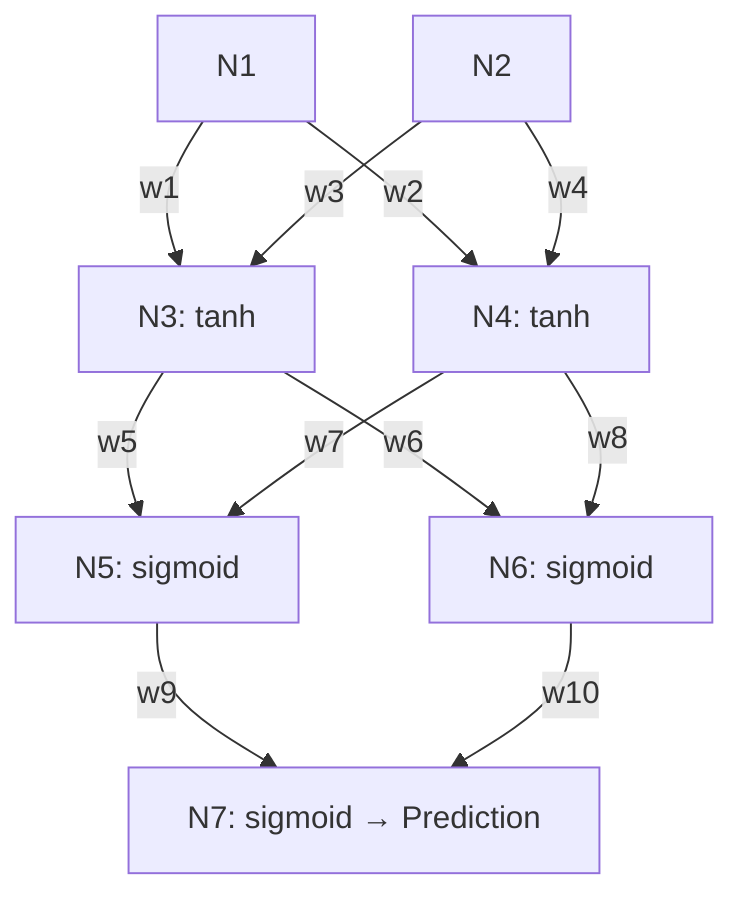

# Basic Neural Network (NN) using C#
How to create a basic Neural Network (NN) with C#

```mermaid
graph TD
  %% Input Layer
  N1[N1]
  N2[N2]

  %% Hidden Layer 1
  N3[N3: tanh]
  N4[N4: tanh]

  %% Hidden Layer 2
  N5[N5: sigmoid]
  N6[N6: sigmoid]

  %% Output Layer
  N7[N7: sigmoid → Prediction]

  %% Connections with weights and biases as comments
  N1 -->|w1| N3
  N1 -->|w2| N4
  N2 -->|w3| N3
  N2 -->|w4| N4

  N3 -->|w5| N5
  N3 -->|w6| N6
  N4 -->|w7| N5
  N4 -->|w8| N6

  N5 -->|w9| N7
  N6 -->|w10| N7
```
